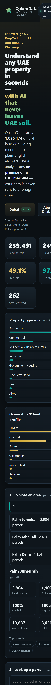

# QalamData — Sovereign UAE Property Intelligence

> Understand any UAE property in seconds, with AI that never leaves UAE soil.

- **Live app:** https://ai.alqalam.ae/qalamdata/
- **Repository:** https://github.com/habib-alqalam/qalamdata
- **By:** Al Qalam AI Solutions · Hub71 Abu Dhabi AI PropTech Challenge (2026)



---

## The problem
Property due diligence and market screening in the UAE is slow and fragmented. Official
land, building and registration data exists as huge open-data exports that nobody reads in
real time. Investors, brokers and planners need an instant, plain-English read on any parcel
or area — without shipping sensitive property data to a foreign cloud.

## What it does
- Search any Dubai **area** or **parcel** → instant intelligence from official records.
- Click **Analyze** → an AI analyst interprets the numbers into a decision-grade brief
  (executive read, key signals, risk flags, recommendation).
- **Dubai** (live, 1M+ records) and **Abu Dhabi** (open-data preview) — pan-UAE, not Dubai-only.

## Why it stands out — data sovereignty
The AI analyst runs **on-premise, on a machine in the UAE** (local Ollama). Property data is
never sent to a foreign cloud. A live badge shows exactly which engine answered:

- 🔒 **Sovereign default** — Qwen/Gemma/Llama on-prem (Ollama), inference stays on UAE soil.
- ☁️ **Optional cloud** — Anthropic Claude (selectable), key held only on the on-prem node.
- ⚡ **Always-on fallback** — deterministic in-browser analyst so the live demo never breaks.

## Real data
- **1,036,474** official records from the **Dubai Land Department** (Dubai Pulse open data):
  259,491 land parcels · 249,816 buildings · 527,167 building summaries · 262 areas.
- Aggregated locally into a **289 KB** intelligence file → instant load, no database.
- **Abu Dhabi**: representative open-data model (Bayanat.ae), structure-identical for live ingestion next.

## Architecture
```
Browser (static site on ai.alqalam.ae)
  ├─ loads compact data/*.json        (no backend DB needed)
  └─ POST /api/analyze  ──HTTPS tunnel──►  On-prem Sovereign AI node (UAE)
                                              ├─ Ollama  (sovereign, default)
                                              └─ Anthropic Claude (optional)
  └─ if node offline → in-browser fallback analyst (demo never breaks)
```

## Run locally
1. Ollama running with a model: `ollama pull qwen2.5:7b`
2. Start the sovereign AI node: `./ai-server/run.ps1`  → http://127.0.0.1:8077
3. Serve the site: from `site/`, `python -m http.server 8080`
4. Open http://127.0.0.1:8080

## Regenerate the Dubai dataset
`node tools/aggregate_dubai.mjs` — streams the DLD JSON exports and writes `site/data/dubai.json`.

## How it maps to the judging criteria
- **Problem** — fragmented, slow, cloud-dependent UAE property due diligence.
- **Execution** — real 1M-record pipeline, instant UI, dual-engine AI, graceful fallback, live deploy.
- **Use of AI** — an on-prem LLM analyst that turns official data into decision-grade advice.
- **Demo clarity** — open the live link, pick an area, click Analyze. That's it.
- **Impact** — faster, sovereign, explainable decisions for investors, brokers and planners.

## Repository structure
- `site/` — deployed static app (data + dashboard + AI client)
- `ai-server/` — on-prem sovereign AI node (Ollama + Anthropic + fallback)
- `tools/` — dataset aggregator
- `docs/`, `agents/`, `deployment/`, `.github/` — governance, demo script, submission form

## Notes for judges
- The live link always works: if the on-prem AI node is offline, the app automatically uses
  the in-browser fallback analyst. When the node is online you get the full sovereign AI.
- API keys are never shipped to the browser — they live only on the on-prem node.
